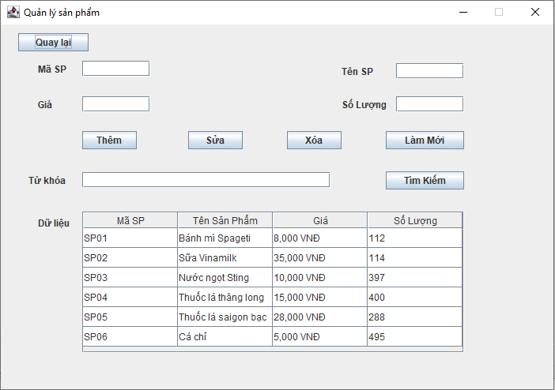
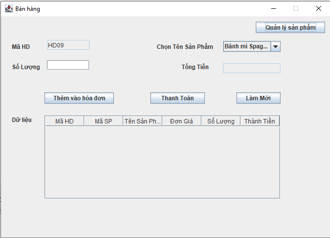
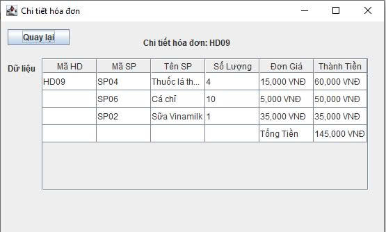

# Hệ Thống Quản Lý Bán Hàng

Ứng dụng quản lý bán hàng được xây dựng bằng Java Swing và SQL Server.

## Chức năng

### Quản lý sản phẩm
- Thêm sản phẩm
- Sửa sản phẩm
- Xóa sản phẩm
- Tìm kiếm sản phẩm

### Quản lý hóa đơn
- Tạo hóa đơn
- Thanh toán
- Tự động cập nhật tồn kho
- Tự động tạo mã hóa đơn

### Chi tiết hóa đơn
- Hiển thị danh sách sản phẩm đã mua
- Hiển thị tổng tiền hóa đơn

## Công nghệ sử dụng

- Java Swing
- JDBC
- SQL Server
- Eclipse IDE
## Giao diện chương trình

### Quản lý sản phẩm

### Hóa đơn

### Chi tiết hóa đơn

